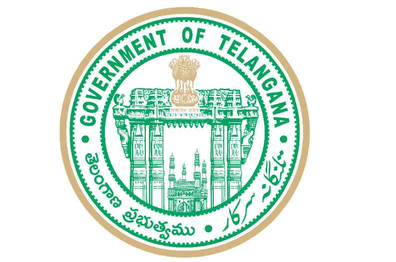

# GRAM — Governance, Risk & Accountability Monitor
### Government of Telangana • పంచాయతీ రాజ్ మరియు గ్రామీణాభివృద్ధి శాఖ

<p align="center">
  
</p>

An enterprise-grade, statewide digital governance platform transforming rural public administration across Telangana. GRAM integrates cadastral GIS asset telemetry, AI-powered predictive infrastructure risk analysis, participatory budgeting polls, and direct citizen accountability.

---

## 🌟 Key Governance Flagships

1. **3D Animated Governance Pipeline**: Executive perspective flow tracking public data velocity from Citizen Voice to Verified Field Development.
2. **Gram Mitra AI Copilot**: Bilingual (English & Telugu) intelligent assistant grounded in real-time village budgets, metrics, and directories.
3. **Interactive Village Cadastral GIS**: Live asset mapping for Mission Bhagiratha valves, primary schools, and geotagged citizen grievances.
4. **Participatory Budgeting & Gram Sabha Polls**: Direct citizen voting on upcoming public capital schemes with single-vote integrity.
5. **AI "What-If" Predictive Development Simulator**: Real-time forecasting calculating score improvements from targeted capital investments.
6. **Mandal Benchmarking Leaderboard**: Comparative performance rankings across neighboring villages in the Mandal.
7. **Rural SOS Quick-Dial & Disaster Advisory**: Live top marquee with 1-tap emergency dispatch (108 Ambulance, 1912 Power, MRO).
8. **Printable Official Village Audit Dossier**: Formatted administrative report card complete with the Telangana State Seal and dynamic QR verification code.

---

## 🛠️ Technology Stack

- **Frontend**: React 18, Vite, Tailwind CSS (Deccan Ivory custom design system), Lucide Icons, React Router v6.
- **Backend**: Python 3.11, FastAPI, SQLAlchemy ORM, Uvicorn ASGI.
- **Database**: PostgreSQL / SQLite compliant with Government of India Local Government Directory (LGD) coding.
- **AI/ML**: Predictive risk scoring, anomaly detection, and localized regression modeling.

---

## 🚀 Getting Started

### Backend Setup
```bash
cd backend
python -m venv venv
.\venv\Scripts\activate
pip install -r requirements.txt
python -m uvicorn app.main:app --host 0.0.0.0 --port 8001 --reload
```

### Frontend Setup
```bash
cd frontend
npm install
npm run dev
```

---

© 2026 Government of Telangana. All rights reserved.
